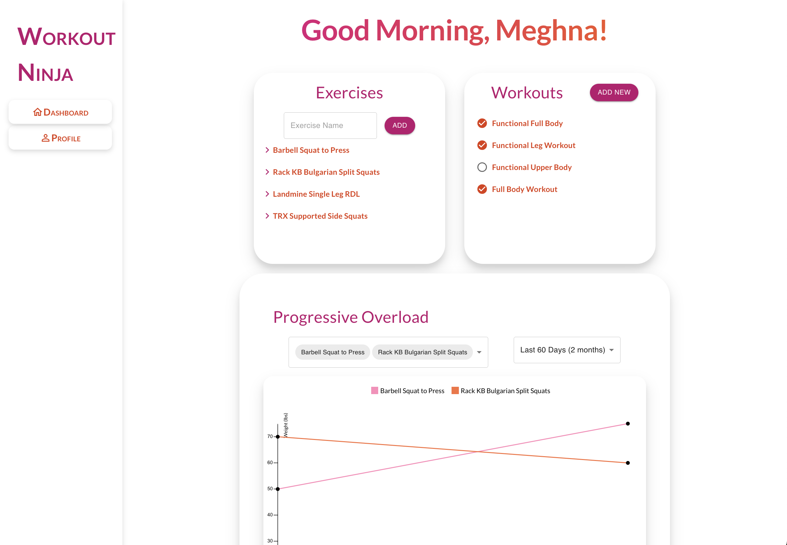
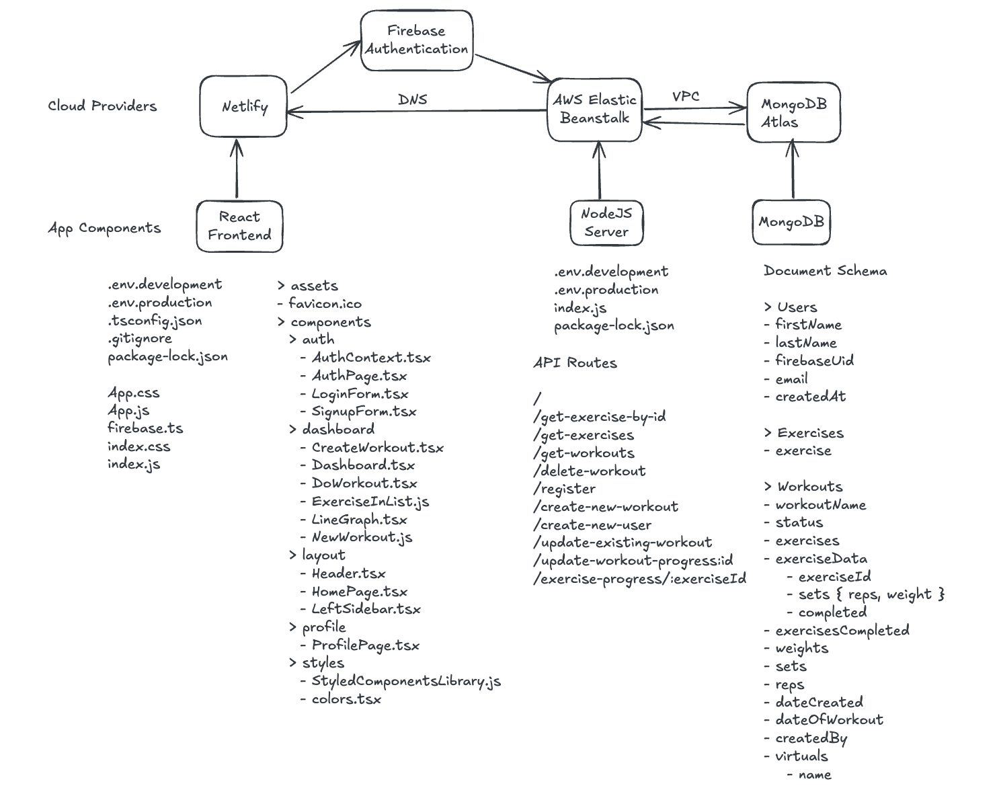

# Workout Ninja

An intuitive and beautiful website that you can use to create your own exercise library, build workouts and track your progressive overload over time. **[workout-ninja.com](workout-ninja.com)**

## Website Architecture

### React + TypeScript Frontend

#### Components

There are 4 main components: **Authentication Flow**, **Main Dashboard**, **Header and Navigation**, **User Profile**.

Users can create new accounts or log in with an existing account, and all authentication is managed within Firebase.

Once authenticated, a user can view their main dashboard where they can add exercises, create and complete workouts and chart their progress over multiple time ranges for a selection of up to 4 exercises.

Users also have access to their profile where they can view their account details and logout of the website.

#### Deployment

The **React website** is deployed on **Netlify** and linked to my Git respository for continuous deployment. A new version is automatically built and deployed when I publish changes to Github.

**Netlify DNS** also automatically enables **SSL** for my custom domain.

### Firebase Authentication

I use **Firebase's Authentication** to keep track of user accounts. The users in Firebase are synced with the User Document in the database to allow me to map the exercises, workouts and progress to each individual user or the admin superuser.

### Environments

I use `.env.development` and `.env.production` files to manage different environment variables throughout the project.

### NodeJS Server

#### API

I used **ExpressJS** to set up the server and manage _CORS_ for localhost and workout-ninja.com, and **Mongoose** to connect to the database.

In addition to the CRUD api routes to access and update the exercises, workouts and users, I also added a route to get the progress metrics for a particular exercise. The `/exercise-progress/:exerciseId` returns the _maxWeight_ and _totalVolume_ for an exercise for all the workouts that included that exercise within the selected time range.

#### Deployment

The **NodeJS server** is deployed on a t3.micro instance on **AWS Elastic Beanstalk**. The server is part of an auto-scaling group and has public and **private IPv4 addresses**. This is how the React app running on a **Netlify server** is able to connect to the AWS server.

I created a **VPC (Virtual Private Cloud)** that connects to the private DNS address of the AWS server and provides a virtual network sitting behind a firewall that the **MongoDB Atlas** can connect to.

### MongoDB Document Database

#### Document Schema

The 3 main documents are **Users**, **Exercises** and **Workouts**. Users correspond to the users in Firebase or the admin superuser. Individual users can create exercises and workouts, and complete workouts.

The **Workout Schema** includes structured exercise data that references exercises from the Exercise Schema which are populated just before the data is returned to the user. The `exerciseData` field comprises an _exerciseId_, a list of _sets_ where each element includes the _reps_ and _weight_, and a boolean flag to mark whether this exercise in the workout was _completed_ by the user. This is the information that is displayed on the progressive overload chart.

#### Deployment

The MongoDB Documents are deployed on **MongoDB Atlas**. I use MongoDB Compass to connect to my cluster in the cloud and sync any changes I made locally.

I set up an **outbound peering connection** from **MongoDB Atlas** to the **AWS EB Virtual Private Cloud**. I also created two security groups - one for IP Address of my AWS server and one for the IP address of my local development server. This allows me to connect to the MongoDB Cluster on the cloud using both development and production environments.

## Product Design

### Product Features

#### Authentication

I created a simple authentication flow that allows users to sign up or log in with an existing account.

#### Dashboard

The main user dashboard is made up of an exercise section where users can add new exercises, a workout section where users can create and complete workouts and a progressive overload chart that allows users to select a time range and choose exercises.

I used Airbnb's **visx** charting library, which is a thin wrapper on D3.js, to build the chart on the dashboard. It was fun to have complete freedom to design each element and customize the colors, placement and interactivity. I used custom colors for the lines, and designed the legend, axes and tooltips to match.

#### Profile

Users can see their account information and log out from the profile section.

### UI Design

#### Theme and Styling

I built a **custom Material UI theme** with a colorscheme comprising of a primary, secondary, neutral and accessory colors. I used background gradients on the buttons and larger text elements to highlight their importance.

I used _box shadows_ and _vertical offsets_ to create dimension on the page and give the website a modern look and feel. I used bright, happy colors and included a direct message to the user to make their dashboard feel personal when they use it.

I used consistent colors, font and spacing throughout for a seamless experience so users can experience a pleasant look and feel while being able to focus all their attention on the content of the page.

## Upcoming Features

- Stripe Checkout
- Posthog Integration
